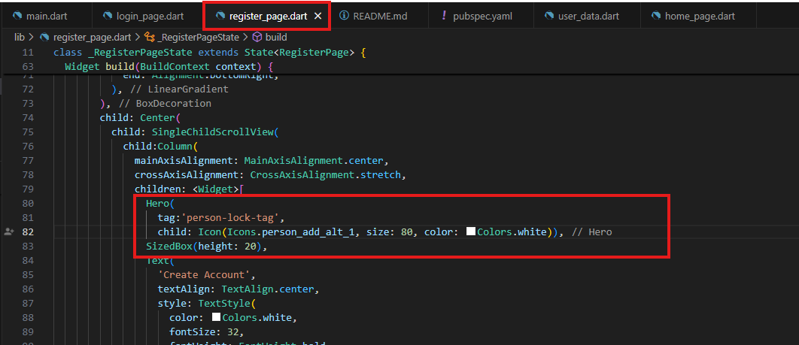

# Pembuatan Form Login dan Registrasi interaktif

## Validasi Input
Kode yang digunakan untuk validasi agar memiliki format tertentu seperti email mengandung '@' dan password memiliki panjang minimal 6 karakter, dapat dilihat pada gambar dibawah: 

Untuk hasilnya pada email jika tidak mengandung '@' maka akan terjadi error seperti pada gambar dibawah: 

Untuk password sendiri jika tidak memiliki panjang 6 karakter akan terjadi seperti pada gambar dibawah:

## Tampilkan/Sembunyikan Password
untuk membuat icon mata di textfield password dan agar icon mata tersebut dapat ditekan untuk menampilkan dan menyembunyikan teks password. Pertama - tama dapat kode seperti dibawah dan kode tersebut ditambahkan pada file register.dart:  

setelah menambahkan kode tersebut, pada textfield dapat menambahkan kode seperti pada gambar dibawah didalam kotak merah:  

untuk hasilnya sendiri dapat dilihat pada gambar dibawah, pada 2 gambar dibawah dapat dilihat ketika icon mata tidak ditekan teks password akan berbentuk bulat - bulat hitam, ketika ditekan teks akan muncul. 

ketika icon mata tidak ditekan: 

ketika icon mata ditekan: 

## Animasi Sederhana
untuk membuat hero widget dapat dilihat pada gambar dibawah. Pada gambar dibawah dapat dilihat kode hero widget di letakkan pada file register_page.dart dikarenakan pada file tersebut terdapat icon yang akan dijadikan animasi pada hero widget:  

pada gambar dibawah ini juga hampir sama penjelasan seperti pada gambar sebelumnya, hanya saja pada gambar dibawah ini diletakkan pada file login_page.dart: 

untuk hasil dari animasi tersebut dapat dilihat pada file berformat .gif dibawah ini: 
Before: 

After: 

## Simpan Sesi Login